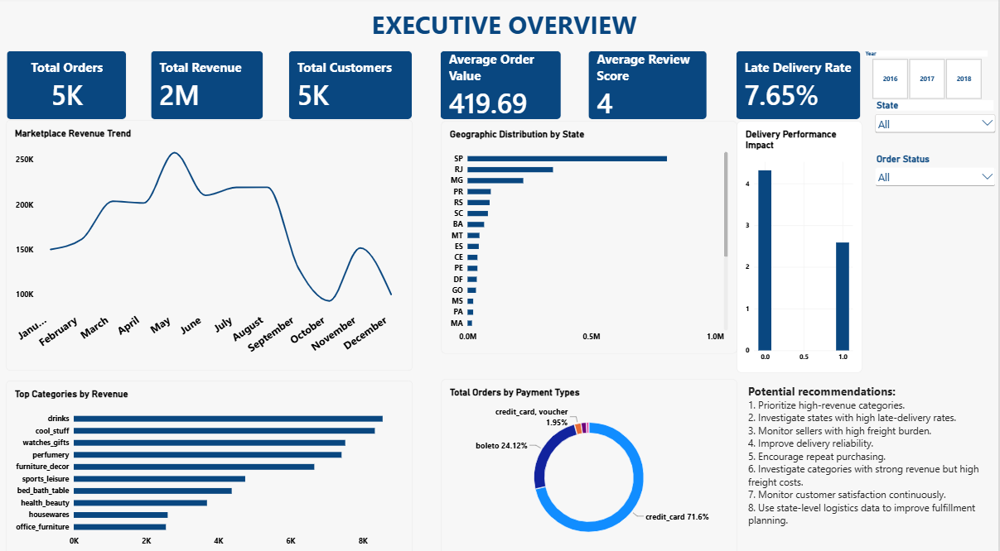
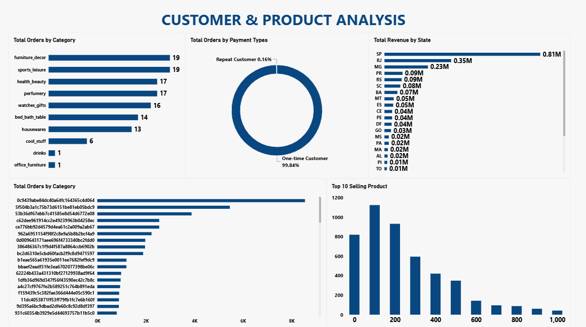
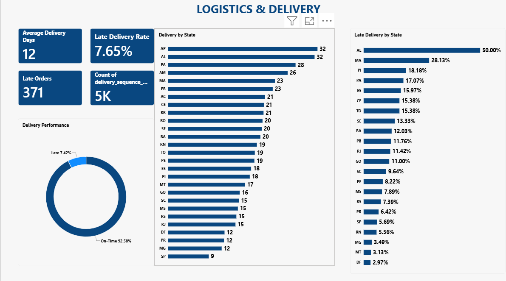
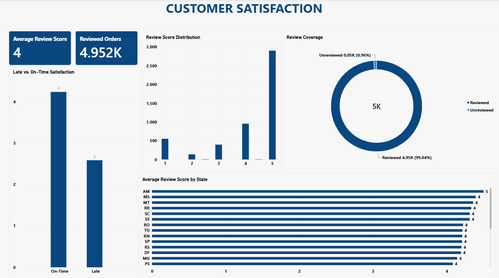

\# Olist E-Commerce Customer \& Logistics Analytics


\## Overview


An end-to-end e-commerce analytics project using the Brazilian

E-Commerce Public Dataset by Olist.


The project analyzes sales performance, customer behavior,

product/category performance, logistics, payments and customer satisfaction.


\## Business Questions


\- How is revenue performing over time?

\- Which categories and products generate the most revenue?

\- Which states generate the most sales?

\- What proportion of customers are repeat customers?

\- How does freight cost vary across categories?

\- How long do customers wait for delivery?

\- Which states have higher late-delivery rates?

\- Is late delivery associated with customer satisfaction?

\- Which payment methods are most frequently used?

\- Which sellers generate the most revenue?


\## Tools


\- MySQL

\- Excel

\- Power BI

\- GitHub


\## Data


Brazilian E-Commerce Public Dataset by Olist.


Approximately 100,000 orders covering the 2016–2018 period.


\## Data Preparation


SQL analytical views were created to:


\- create an order-level analytical dataset

\- aggregate order items

\- aggregate reviews

\- aggregate payments

\- handle missing date values

\- prevent duplicated revenue

\- flag delivery-sequence anomalies


\## Data Quality


The final analytical order view contains 99,441 unique orders.


Revenue reconciliation between the analytical view and source order-item

data produced a difference of 0.00.


One review record was not loaded compared with the expected source count.

This represents approximately 0.001% of review records.


\## Dashboard


\### Executive Overview





\### Customer \& Product Analysis





\### Logistics \& Delivery





\### Customer Satisfaction





## 📁 Project Structure & Data Availability
```text
Olist-Ecommerce-Analytics/
├── SQL_Scripts/                # Database queries and cleaning scripts
├── Images/                     # Rendered dashboard screenshots
│   ├── Executive_Overview.png
│   ├── Customer_Product_Analysis.png
│   ├── Logistics_Delivery.png
│   └── Customer_Satisfaction.png
├── Olist_Ecommerce_Analytics.pbix  # Main interactive dashboard file
└── README.md                   # Project documentation
```
*Note: Due to file size limitations on GitHub, raw source datasets are maintained locally. Cleaned aggregations and visual data schemas are fully accessible via the interactive Power BI file.*

---

## 💡 Data-Driven Insights & Business Recommendations

### 1. Executive Summary & Revenue Drivers
* **Insight:** Total sales revenue reached **$2 Million** across **5,000 Total Orders**, maintaining an Average Order Value (AOV) of **$419.69**. 
* **Recommendation:** Focus marketing efforts on the "bed_bath_table", "health_beauty", and "sports_leisure" categories, as they represent the highest volume trends driving the $2M top-line revenue.

### 2. Customer & Product Dynamics
* **Insight:** Repeat customer behavior is critically low, with **One-Time Customers accounting for 93.84%** of the entire database, leaving repeat shoppers at just 6.16%.
* **Recommendation:** Launch an automated post-purchase email retention campaign or loyalty points system targeted at one-time buyers within their first 30 days to systematically lift the 6.16% retention floor.

### 3. Logistics & Delivery Performance Breakdown
* **Insight:** The system flags a critical fulfillment bottleneck: the **Average Delivery Time stands at 12 Days**, pushing the **Late Delivery Rate to 7.65%** (translating to 371 totally delayed orders).
* **Recommendation:** Investigate shipping routes into **AM and AL**, which exhibit the highest late delivery distributions (reaching up to **50.00% late delivery rates** in specific regional corridors). Renegotiate SLAs with regional third-party logistics (3PL) partners or shift volume to higher-performing carriers.

### 4. Customer Satisfaction & Review Impact
* **Insight:** While the business maintains an **Average Review Score of 4 out of 5**, there is a severe drop in sentiment linked to fulfillment quality. On-time orders average high satisfaction, whereas late orders consistently trigger 1 and 2-star reviews.
* **Recommendation:** Implement a proactive customer support alert system. If an order enters a delayed state, automatically trigger an email containing an apology and a small discount code *before* the customer receives the item to insulate the average review score from dropping below 4.
